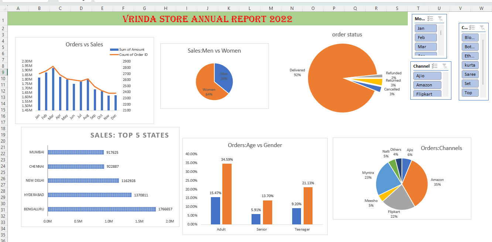

# Vrinda Store Sales Analysis (Excel Dashboard)

## Project Overview
This project analyzes Vrinda Store's 2022 sales data using Microsoft Excel.  
The dashboard provides insights into customer behavior, sales trends, order status, and channel performance.

## Tools Used
- Microsoft Excel
- Pivot Tables
- Pivot Charts
- Slicers
- Data Visualization

## Key Insights
- Women customers contribute around 64% of total sales.
- Adult age group generates the highest number of orders.
- Amazon is the leading sales channel.
- Bengaluru, Hyderabad, and Delhi are the top performing cities.
- 92% of orders are successfully delivered.

## Dashboard Preview

